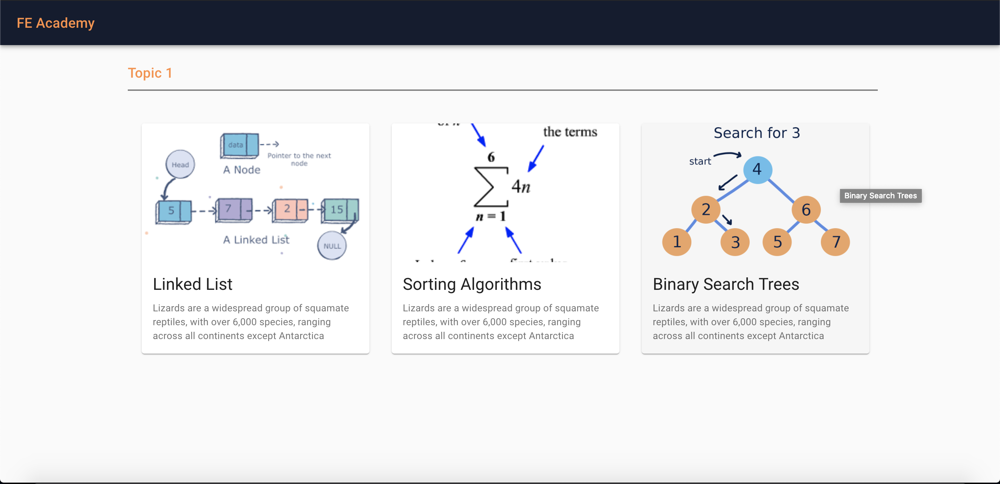
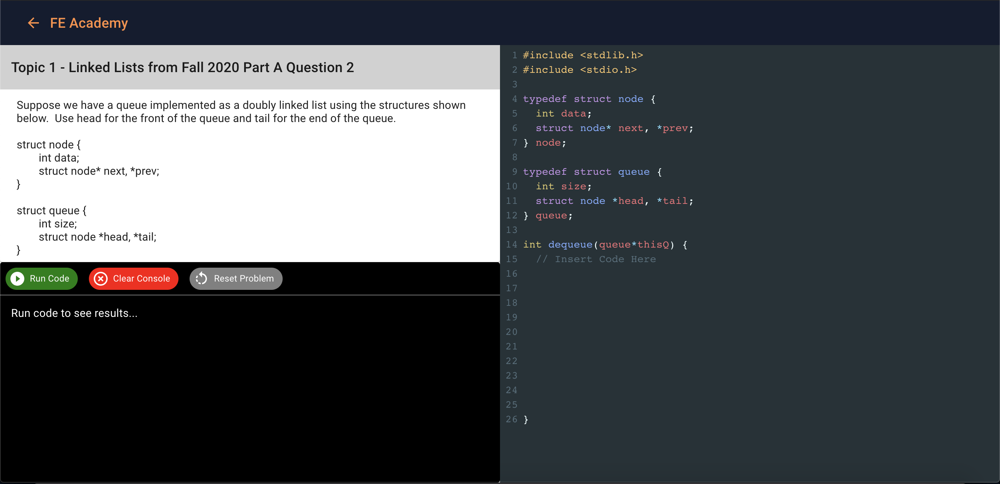

<!-- PROJECT SHIELDS -->
<!--
*** I'm using markdown "reference style" links for readability.
*** Reference links are enclosed in brackets [ ] instead of parentheses ( ).
*** See the bottom of this document for the declaration of the reference variables
*** for contributors-url, forks-url, etc. This is an optional, concise syntax you may use.
*** https://www.markdownguide.org/basic-syntax/#reference-style-links
-->


<!-- PROJECT LOGO -->
<br />
<p align="center">
  <a href="https://github.com/dlam96/Knight-Hacks-2020">
    
  </a>

  <h3 align="center">FE Academy Web Application</h3>

  <p align="center">
    An interactive coding environment that teaches Computer Science fundamentals!
    <br />
    <br />
    <a href="https://github.com/dlam96/Knight-Hacks-2020/">View Demo</a>
    ·
    <a href="https://github.com/dlam96/Knight-Hacks-2020/issues">Report Bug</a>
    ·
    <a href="https://github.com/dlam96/Knight-Hacks-2020/issues">Request Feature</a>
  </p>
</p>


<!-- TABLE OF CONTENTS -->
## Table of Contents

* [About the Project](#about-the-project)
  * [Built With](#built-with)
* [Getting Started](#getting-started)
  * [Installation](#installation)
* [Contributing](#contributing)
* [License](#license)
* [Contact](#contact)
* [Acknowledgements](#acknowledgements)


<!-- ABOUT THE PROJECT -->
## About The Project
<p align="center">
  <a href="https://github.com/dlam96/Knight-Hacks-2020">
    
  </a>
</p>

At the University of Central Florida, emerging Computer Science students are required to take a Foundation Exam (FE) in order to get accepted into the college. Although there are many great resources available online to learn about Data Structures and Algorithms, Our team didn't find one that really suit my needs when I was a student studying for the FE exam so we created FE Academy. The solutions posted from previous exams were just one way of solving the problem and we wanted to create a way to detect if other variations of solutions would also solve the same problem. So we created an immersive, interactive experience so amazing that it'll be the last resource you'll ever need to prepare for the Foundation Exam.

Here's why:
* Your time should be focused on mastering Computer Science fundamentals, not searching high and low trying to find the right resources.
* All topics in one place. No need to keep track of whether you missed studying any of the topics, FE Academy has all the fundamental topics in one place!
* See feedback immediately! FE Academy has a built-in text editor and compiler that will run your code through our handwritten testcases for each problem. 

<p align="center">
  <a href="https://github.com/dlam96/Knight-Hacks-2020">
    
  </a>
</p>

### Built With
* [ReactJS](https://reactjs.org)
* [CodeMirror2](https://www.npmjs.com/package/react-codemirror2)
* [Material-UI](https://material-ui.com/)

<!-- GETTING STARTED -->
## Getting Started

### Installation

1. Clone the repo
```sh
git clone https://github.com/dlam96/Knight-Hacks-2020
```
2. Install NPM packages
```sh
yarn install
```
3. Start the server
```sh
yarn start
```


<!-- LICENSE -->
## License

Distributed under the MIT License. 


<!-- CONTACT -->
## Contact

[Daniel Lam](https://github.com/dlam96) - FrontEnd Lead - [Linked-in](https://www.linkedin.com/in/dlam96) - dlam96@knights.ucf.edu

[Justin Hawtree](https://github.com/JustinHawtree) - BackEnd Lead - [Linked-in](https://www.linkedin.com/in/justin-hawtree) - JustinHawtree@knights.ucf.edu

[Leo Zhang](https://github.com/leozhang1) - FrontEnd Dev 

Project Link: [DevPost](https://devpost.com/software/fe-academy?ref_content=user-portfolio&ref_feature=in_progress)


<!-- ACKNOWLEDGEMENTS -->
## Acknowledgements
* [Knight Hacks](https://knighthacks.org/)
* [FE Academy BackEnd Repo](https://github.com/JustinHawtree/FoundationHelper_KnightHacks2020)


<!-- MARKDOWN LINKS & IMAGES -->
<!-- https://www.markdownguide.org/basic-syntax/#reference-style-links -->
[product-screenshot]: images/demo1.png
